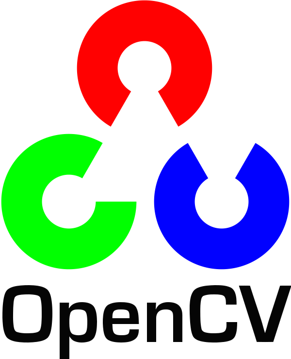
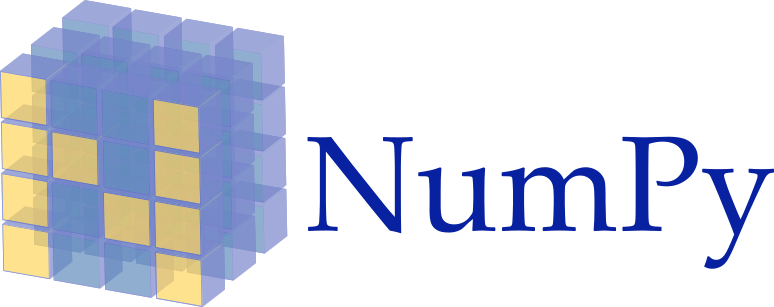

# Agent
This repository will host all initial machine learning efforts applying the [Neodroid](https://github.com/sintefneodroid/) platform.

---

_[Neodroid](https://github.com/sintefneodroid) is developed with support from Research Council of Norway Grant #262900. ([https://www.forskningsradet.no/prosjektbanken/#/project/NFR/262900](https://www.forskningsradet.no/prosjektbanken/#/project/NFR/262900))_

---


| [](https://travis-ci.org/sintefneodroid/agent)  | [](https://coveralls.io/github/sintefneodroid/agent?branch=master)  | [](https://github.com/sintefneodroid/agent/issues)  |  [](https://github.com/sintefneodroid/agent/network) | [](https://github.com/sintefneodroid/agent/stargazers) |[](https://github.com/sintefneodroid/agent/blob/master/LICENSE.md) |
|---|---|---|---|---|---|

<p align="center" width="100%">
<a href="https://www.python.org/">

</a>
<a href="https://opencv.org/" style="float:center;">

</a>
<a href="http://pytorch.org/"style="float: right;">

</a>
</p>
<p align="center" width="100%">
<a href="http://www.numpy.org/">

</a>
<a href="https://github.com/tqdm/tqdm" style="float:center;">

</a>
<a href="https://matplotlib.org/" style="float: right;">

</a>
</p>

# Contents Of This Readme
- [Algorithms](#algorithms)
- [Requirements](#requirements)
- [Usage](#usage)
- [Results](#results)
  - [Target Point Estimator](#target-point-estimator)
  - [Perfect Information Navigator](#perfect-information-navigator)
- [Contributing](#contributing)
- [Other Components](#other-components-of-the-neodroid-platform)

# Algorithms
- [REINFORCE (PG)](agent/agents/model_free/policy_optimisation/pg_agent.py)
- [DQN](agent/agents/model_free/q_learning/dqn_agent.py)
- [DDPG](agent/agents/model_free/hybrid/ddpg_agent.py)
- [PPO](agent/agents/model_free/hybrid/ppo_agent.py)
- TRPO, GA, EVO, IMITATION...


## **Algorithms Implemented** 

1. *Deep Q Learning (DQN)* <sub><sup> ([Mnih et al. 2013](https://arxiv.org/pdf/1312.5602.pdf)) </sup></sub>  
1. *DQN with Fixed Q Targets* <sub><sup> ([Mnih et al. 2013](https://arxiv.org/pdf/1312.5602.pdf)) </sup></sub>
1. *Double DQN (DDQN)* <sub><sup> ([Hado van Hasselt et al. 2015](https://arxiv.org/pdf/1509.06461.pdf)) </sup></sub>
1. *DDQN with Prioritised Experience Replay* <sub><sup> ([Schaul et al. 2016](https://arxiv.org/pdf/1511.05952.pdf)) </sup></sub>
1. *Dueling DDQN* <sub><sup> ([Wang et al. 2016](http://proceedings.mlr.press/v48/wangf16.pdf)) </sup></sub>
1. *REINFORCE* <sub><sup> ([Williams et al. 1992](http://www-anw.cs.umass.edu/~barto/courses/cs687/williams92simple.pdf)) </sup></sub>
1. *Deep Deterministic Policy Gradients (DDPG)* <sub><sup> ([Lillicrap et al. 2016](https://arxiv.org/pdf/1509.02971.pdf) ) </sup></sub>
1. *Twin Delayed Deep Deterministic Policy Gradients (TD3)* <sub><sup> ([Fujimoto et al. 2018](https://arxiv.org/abs/1802.09477)) </sup></sub>
1. *Soft Actor-Critic (SAC & SAC-Discrete)* <sub><sup> ([Haarnoja et al. 2018](https://arxiv.org/pdf/1812.05905.pdf)) </sup></sub> 
1. *Asynchronous Advantage Actor Critic (A3C)* <sub><sup> ([Mnih et al. 2016](https://arxiv.org/pdf/1602.01783.pdf)) </sup></sub>
1. *Syncrhonous Advantage Actor Critic (A2C)*
1. *Proximal Policy Optimisation (PPO)* <sub><sup> ([Schulman et al. 2017](https://openai-public.s3-us-west-2.amazonaws.com/blog/2017-07/ppo/ppo-arxiv.pdf)) </sup></sub>
1. *DQN with Hindsight Experience Replay (DQN-HER)* <sub><sup> ([Andrychowicz et al. 2018](https://arxiv.org/pdf/1707.01495.pdf)) </sup></sub>
1. *DDPG with Hindsight Experience Replay (DDPG-HER)* <sub><sup> ([Andrychowicz et al. 2018](https://arxiv.org/pdf/1707.01495.pdf) ) </sup></sub>
1. *Hierarchical-DQN (h-DQN)* <sub><sup> ([Kulkarni et al. 2016](https://arxiv.org/pdf/1604.06057.pdf)) </sup></sub>
1. *Stochastic NNs for Hierarchical Reinforcement Learning (SNN-HRL)* <sub><sup> ([Florensa et al. 2017](https://arxiv.org/pdf/1704.03012.pdf)) </sup></sub>
1. *Diversity Is All You Need (DIAYN)* <sub><sup> ([Eyensbach et al. 2018](https://arxiv.org/pdf/1802.06070.pdf)) </sup></sub>

## **Environments Implemented**

1. *Bit Flipping Game* <sub><sup> (as described in [Andrychowicz et al. 2018](https://arxiv.org/pdf/1707.01495.pdf)) </sup></sub>
1. *Four Rooms Game* <sub><sup> (as described in [Sutton et al. 1998](http://www-anw.cs.umass.edu/~barto/courses/cs687/Sutton-Precup-Singh-AIJ99.pdf)) </sup></sub>
1. *Long Corridor Game* <sub><sup> (as described in [Kulkarni et al. 2016](https://arxiv.org/pdf/1604.06057.pdf)) </sup></sub>
1. *Ant-{Maze, Push, Fall}* <sub><sup> (as desribed in [Nachum et al. 2018](https://arxiv.org/pdf/1805.08296.pdf) and their accompanying [code](https://github.com/tensorflow/models/tree/master/research/efficient-hrl)) </sup></sub>


# Requirements
- pytorch
- tqdm
- Pillow
- numpy
- matplotlib
- torchvision
- torch
- Neodroid
- pynput

(Optional)
- visdom
- gym

To install these use the command:
````bash
pip3 install -r requirements.txt
````

# Usage
Export python path to the repo root so we can use the utilities module
````bash
export PYTHONPATH=/path-to-repo/
````
For training a agent use:
````bash
python3 procedures/train_agent.py
````
For testing a trained agent use:
````bash
python3 procedures/test_agent.py
````

# Results

## Target Point Estimator
Using Depth, Segmentation And RGB images to estimate the location of target point in an environment.

### [REINFORCE (PG)](agent/agents/model_free/policy_optimisation/pg_agent.py)

### [DQN](agent/agents/model_free/q_learning/dqn_agent.py)

### [DDPG](agent/agents/model_free/hybrid/ddpg_agent.py)

### [PPO](agent/agents/model_free/hybrid/ppo_agent.py)

### GA, EVO, IMITATION...

## Perfect Information Navigator
Has access to perfect location information about the obstructions and target in the environment, the objective is to navigate to the target with colliding with the obstructions.

### [REINFORCE (PG)](agent/agents/model_free/policy_optimisation/pg_agent.py)

### [DQN](agent/agents/model_free/q_learning/dqn_agent.py)

### [DDPG](agent/agents/model_free/hybrid/ddpg_agent.py)

### [PPO](agent/agents/model_free/hybrid/ppo_agent.py)

### GA, EVO, IMITATION...


# Contributing
See guidelines for contributing [here](.github/CONTRIBUTING.md).


# Licensing

This project is licensed under the Apache V2 License. See [LICENSE](LICENSE.md) for more information.

# Citation

For citation you may use the following bibtex entry:

````
@misc{neodroid-agent,
  author = {Heider, Christian},
  title = {Neodroid Platform Agents},
  year = {2018},
  publisher = {GitHub},
  journal = {GitHub repository},
  howpublished = {\url{https://github.com/sintefneodroid/agent}},
}
````

# Other Components Of the Neodroid Platform

- [neo](https://github.com/sintefneodroid/neo)
- [droid](https://github.com/sintefneodroid/droid)

# Authors

* **Christian Heider Nielsen** - [cnheider](https://github.com/cnheider)

Here other [contributors](https://github.com/sintefneodroid/agent/contributors) to this project are listed.
